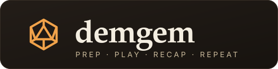
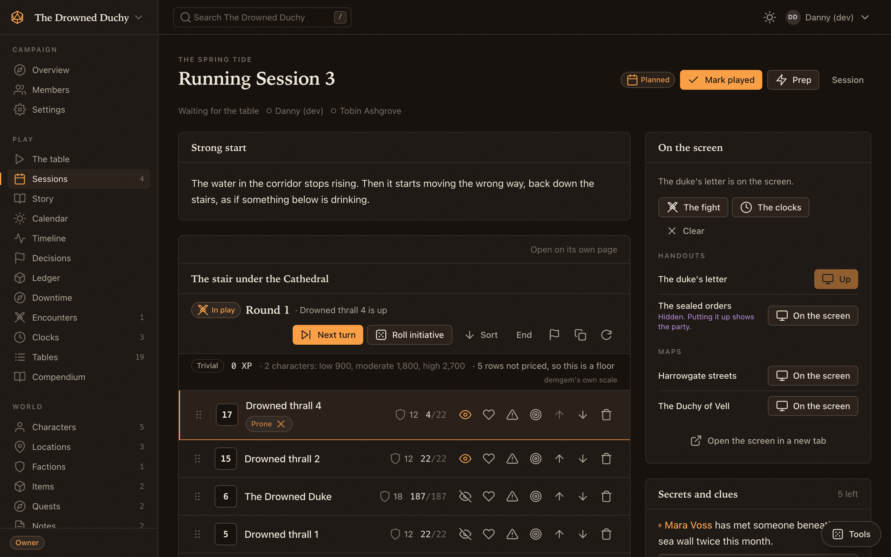
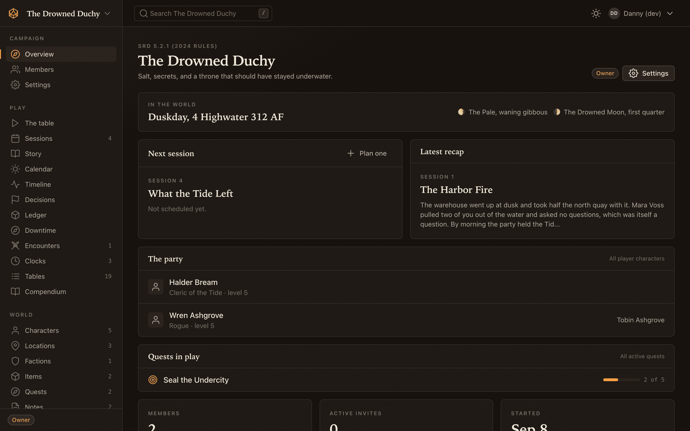
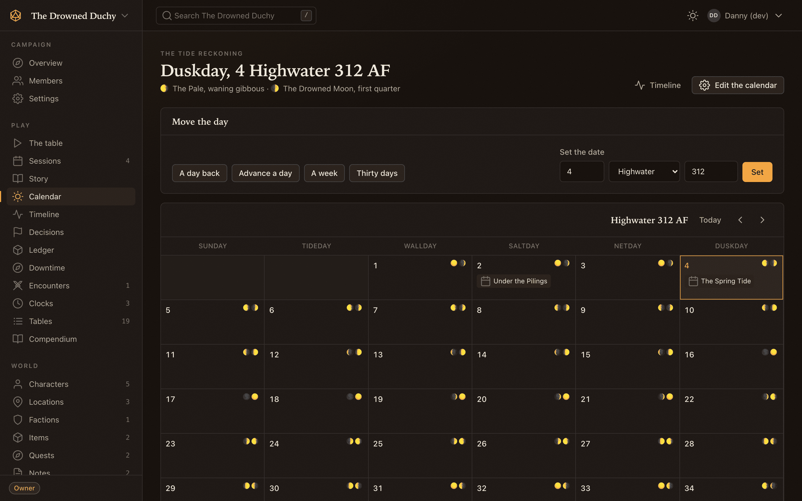
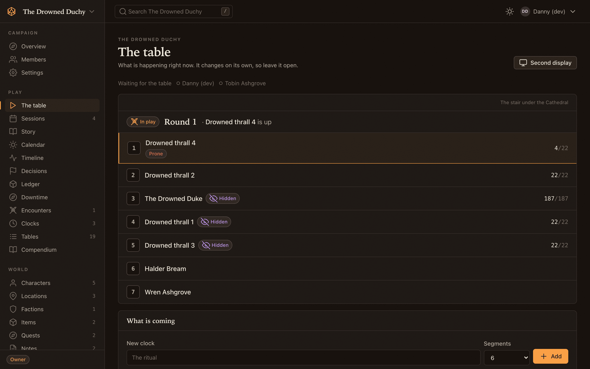

<p align="center">
  
</p>

<p align="center">
  <strong>An open source campaign manager for Dungeon Masters and Game Masters.</strong><br>
  Prepare sessions, run encounters, and keep track of your campaign.
</p>

<p align="center">
  <a href="https://github.com/dannyclarkdev/demgem/actions/workflows/ci.yml"></a>
  <a href="LICENSE"></a>
  
  
  
  <a href="docs/guide/docker.md"></a>
</p>

<p align="center">
  <a href="#run-it-in-three-commands">Run it</a> ·
  <a href="#what-it-does">What it does</a> ·
  <a href="#documentation">Documentation</a> ·
  <a href="docs/guide/api.md">API</a> ·
  <a href="docs/guide/changelog.md">Changelog</a>
</p>

<br>

<p align="center">
  
</p>

<p align="center"><sub>Session notes, combat tracking, and player display controls.</sub></p>

<br>

## About demgem

Use demgem to plan sessions, track combat, share maps and handouts, and write recaps. Keep your NPCs, locations, quests, and notes linked to the sessions where you need them. Players can follow initiative, manage their characters, and read what you've shared with them.

You can use it with any game system. The optional SRD 5.2.1 ruleset adds 330 creatures, encounter budgets, and a 5e character sheet. Without a ruleset, you can add your own creatures and use the rest of the campaign tools.

## What it does

<table>
  <tr>
    <td width="50%" valign="top">
      <h3>🎬 Session prep</h3>
      Plan an opening, arrange scenes, and prepare secrets and clues. Add NPCs, locations, monsters, and treasure to each session. During play, notes autosave and you can reveal secrets as needed. Publish a recap afterward; unrevealed secrets carry over to the next session.
    </td>
    <td width="50%" valign="top">
      <h3>⚡ Live initiative and dice</h3>
      Turn order and rounds update across everyone’s screens as the GM advances combat. Players see health descriptions, and dice rolls are shared with the table. GMs can also roll privately.
    </td>
  </tr>
  <tr>
    <td valign="top">
      <h3>🖥️ Player display</h3>
      Open <code>/screen</code> on a TV or shared monitor to show the party an encounter, handout, map, or progress clocks. Switch what’s displayed from the session view.
    </td>
    <td valign="top">
      <h3>⚔️ Encounter tracking</h3>
      Track initiative, hit points, conditions, concentration, death saves, and legendary and lair actions. Estimate encounter difficulty from Trivial to Deadly, add creatures with their stats from the compendium, and duplicate encounters for reuse.
    </td>
  </tr>
  <tr>
    <td valign="top">
      <h3>📖 Creature compendium</h3>
      Browse 330 SRD creatures by type and challenge rating, or write your own in Markdown. Use <strong>Copy to my campaign</strong> to make an editable copy of an included creature.
    </td>
    <td valign="top">
      <h3>📜 5e character sheets</h3>
      Manage ability scores, proficiencies, expertise, hit dice, and spell slots, with modifiers calculated automatically. Players can edit their sheets, record damage, and take a long rest.
    </td>
  </tr>
  <tr>
    <td valign="top">
      <h3>🗺️ Maps, handouts, and clocks</h3>
      Upload maps with pins linked to campaign pages or other maps. Pan, zoom, and reveal pins as the party explores. Attach up to ten files to a handout and update progress clocks during play.
    </td>
    <td valign="top">
      <h3>🌙 Custom calendars</h3>
      Define months, weeks, moons, leap rules, and eras for your setting. View the current date on the dashboard, moon phases on the calendar, and events and sessions on a timeline.
    </td>
  </tr>
  <tr>
    <td valign="top">
      <h3>🧭 Campaign wiki</h3>
      Organize characters, locations, factions, items, quests, arcs, journals, and notes. Pages support Markdown, <code>[[wiki links]]</code>, backlinks, tags, nesting, images, and search. GM notes and <code>:::secret</code> blocks stay hidden from players, including in search and API responses.
    </td>
    <td valign="top">
      <h3>🧾 Quests and party records</h3>
      Track quest objectives and when they were completed. Group quests and sessions into story arcs. Record party decisions, money, items, downtime, faction reputation, family trees, and relationships between pages.
    </td>
  </tr>
  <tr>
    <td valign="top">
      <h3>📦 Export and import</h3>
      Download a campaign archive with JSON data, images, attachments, and Markdown pages you can open in Obsidian. Export JSON on its own if you only need the data. Import either format into another demgem installation.
    </td>
    <td valign="top">
      <h3>🔌 API, Discord, and scheduling</h3>
      Access campaign data through <code>/api/v1</code> with the same permissions as the app. Send recap notifications to Discord. Members can RSVP, vote on session times, and receive reminder emails.
    </td>
  </tr>
</table>

<br>

<table>
  <tr>
    <td width="33%"></td>
    <td width="33%"></td>
    <td width="33%"></td>
  </tr>
  <tr>
    <td align="center"><sub>Campaign dashboard</sub></td>
    <td align="center"><sub>World calendar</sub></td>
    <td align="center"><sub>Player combat view</sub></td>
  </tr>
</table>

## Run it in three commands

Requires Docker 24 or newer with Compose v2. All application dependencies run in containers.

```sh
cp .env.docker.example .env.docker
docker compose run --rm --no-deps app php artisan key:generate --show   # paste the key into APP_KEY in .env.docker
docker compose up -d
```

Open <http://localhost:8000> and register. After the first account is created, registration requires an invite link. The stack runs the app, a queue worker, the scheduler, the Reverb websocket server, PostgreSQL, and Redis. The [Docker guide](docs/guide/docker.md) covers ports, HTTPS, object storage, and running without the websocket.

For a development machine with PHP 8.4, Node 20, and PostgreSQL, see [Local setup](docs/guide/local-setup.md). The guide also covers seeding a demo campaign with GM and player accounts.

## Documentation

| Guide | What it covers |
| --- | --- |
| [Local setup](docs/guide/local-setup.md) | Requirements, installation, background services, and demo data. |
| [Docker](docs/guide/docker.md) | Services, configuration, and deployment. |
| [Live table](docs/guide/live-table.md) | Websockets, Reverb, proxies, and polling fallback. |
| [Reminders, Discord, and calendar feeds](docs/guide/reminders-and-discord.md) | Email, scheduling, webhooks, and calendar subscriptions. |
| [Export and import](docs/guide/export-and-import.md) | Campaign archives, JSON, and Obsidian exports. |
| [Templates and body history](docs/guide/templates-and-history.md) | Reusable page templates and previous versions. |
| [API](docs/guide/api.md) | API keys, endpoints, and permissions. |
| [Contributing](docs/guide/contributing.md) | Code conventions, development commands, configuration, and timezones. |
| [Changelog](docs/guide/changelog.md) | Feature history and implementation plans. |

## Built with

[Laravel 13](https://laravel.com), [Livewire 4](https://livewire.laravel.com), [Alpine](https://alpinejs.dev), and [Tailwind 4](https://tailwindcss.com), on PHP 8.4. [Reverb](https://reverb.laravel.com) handles live updates. The app uses PostgreSQL in production and SQLite for local tests.

## Contributing

Issues and pull requests are welcome. See the [contributing guide](docs/guide/contributing.md) for setup, conventions, and testing. CI runs Pint, Larastan, and Pest tests on PostgreSQL, then builds and boots the Docker image.

## Content licensing

demgem's code is licensed under MIT. The creature data in `database/srd/` comes from the System Reference Document 5.2.1, published by Wizards of the Coast LLC under [CC BY 4.0](https://creativecommons.org/licenses/by/4.0/legalcode).

> This work includes material taken from the System Reference Document 5.2.1 ("SRD 5.2.1") by Wizards of the Coast LLC and is licensed under the Creative Commons Attribution 4.0 International License, available at https://creativecommons.org/licenses/by/4.0/legalcode.

The attribution notice appears in the compendium and SRD stat block API responses. See [attribution requirements](database/srd/ATTRIBUTION.md) and [dataset provenance](database/srd/README.md) for details.

## License

MIT. See [LICENSE](LICENSE).
